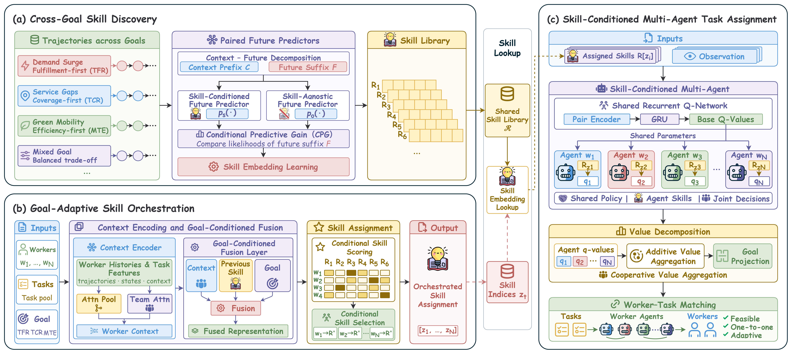

# MASDO: Multi-Agent Skill Discovery and Orchestration for Goal-Adaptive Task Assignment

<p align="center">
  
</p>

## Running

- **Data Preparation:** Download [Foursquare-TKY and Foursquare-NYC](https://sites.google.com/site/yangdingqi/home/foursquare-dataset) and [Porto Taxi](https://archive.ics.uci.edu/dataset/339/taxi+service+trajectory+prediction+challenge+ecml+pkdd+2015). Convert the raw data to the [scenario JSON format](data/README.md) and place the files in `data/prepared/`.

- **Training:** Set the data paths and training options in [configs/train.json](configs/train.json), then run:

  ```bash
  python train.py --config configs/train.json
  ```

- **Evaluation:** Set the scenario, checkpoint and objective in [configs/default.json](configs/default.json), then run:

  ```bash
  python run.py --config configs/default.json
  ```

## Requirements

Tested environment:

```text
Python 3.12.14
PyTorch 2.10.0
NumPy 1.26.4
SciPy 1.13.1
```

```bash
python -m pip install -r requirements.txt
```
